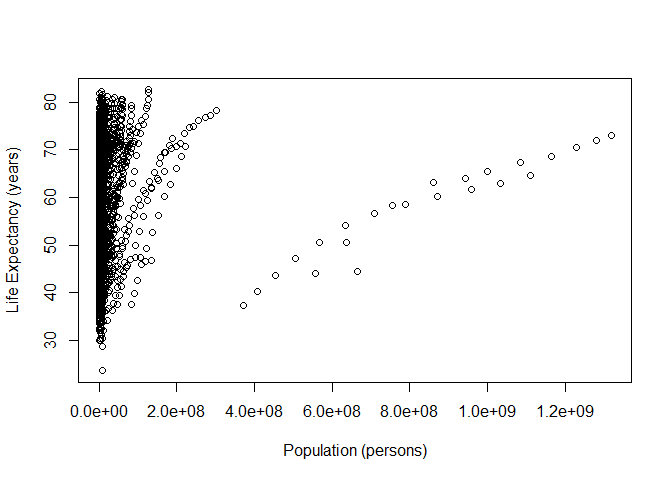
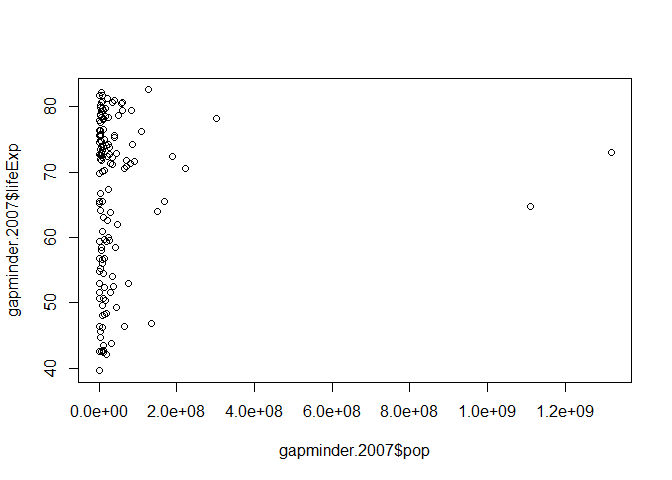

STAT545 Assignment 1
================
Alex
September 18, 2018

Initializing the Dataset
========================

I am choosing to explore the *gapminder* dataset for this assignment.

Let's look at a quick summary of the variables
----------------------------------------------

``` r
summary(gapminder)
```

    ##         country        continent        year         lifeExp     
    ##  Afghanistan:  12   Africa  :624   Min.   :1952   Min.   :23.60  
    ##  Albania    :  12   Americas:300   1st Qu.:1966   1st Qu.:48.20  
    ##  Algeria    :  12   Asia    :396   Median :1980   Median :60.71  
    ##  Angola     :  12   Europe  :360   Mean   :1980   Mean   :59.47  
    ##  Argentina  :  12   Oceania : 24   3rd Qu.:1993   3rd Qu.:70.85  
    ##  Australia  :  12                  Max.   :2007   Max.   :82.60  
    ##  (Other)    :1632                                                
    ##       pop              gdpPercap       
    ##  Min.   :6.001e+04   Min.   :   241.2  
    ##  1st Qu.:2.794e+06   1st Qu.:  1202.1  
    ##  Median :7.024e+06   Median :  3531.8  
    ##  Mean   :2.960e+07   Mean   :  7215.3  
    ##  3rd Qu.:1.959e+07   3rd Qu.:  9325.5  
    ##  Max.   :1.319e+09   Max.   :113523.1  
    ## 

How many countries are in this dataset?
---------------------------------------

``` r
length(gapminder$country)
```

    ## [1] 1704

Not sure how many countries are in the world but I assume this is **all** of them.

What information does this dataset have on Canada?
--------------------------------------------------

``` r
filter(gapminder, country == "Canada")
```

    ## # A tibble: 12 x 6
    ##    country continent  year lifeExp      pop gdpPercap
    ##    <fct>   <fct>     <int>   <dbl>    <int>     <dbl>
    ##  1 Canada  Americas   1952    68.8 14785584    11367.
    ##  2 Canada  Americas   1957    70.0 17010154    12490.
    ##  3 Canada  Americas   1962    71.3 18985849    13462.
    ##  4 Canada  Americas   1967    72.1 20819767    16077.
    ##  5 Canada  Americas   1972    72.9 22284500    18971.
    ##  6 Canada  Americas   1977    74.2 23796400    22091.
    ##  7 Canada  Americas   1982    75.8 25201900    22899.
    ##  8 Canada  Americas   1987    76.9 26549700    26627.
    ##  9 Canada  Americas   1992    78.0 28523502    26343.
    ## 10 Canada  Americas   1997    78.6 30305843    28955.
    ## 11 Canada  Americas   2002    79.8 31902268    33329.
    ## 12 Canada  Americas   2007    80.7 33390141    36319.

How much did Canada change between 1952 and 2007?
-------------------------------------------------

``` r
filter(gapminder, country == "Canada", year == "2007") - filter(gapminder, country == "Canada", year == "1952")
```

    ##   country continent year lifeExp      pop gdpPercap
    ## 1      NA        NA   55  11.903 18604557  24952.07

Over 55 years, life expectancy went up by 11.9 years, population increased by 18.6 million, and GDP per capita increased by 25 thousand dollars.

Some Preliminary Statistics Exploration
=======================================

Is Life expectancy correlated with GDP per capita?
--------------------------------------------------

``` r
cor.test(gapminder$lifeExp, gapminder$gdpPercap)
```

    ## 
    ##  Pearson's product-moment correlation
    ## 
    ## data:  gapminder$lifeExp and gapminder$gdpPercap
    ## t = 29.658, df = 1702, p-value < 2.2e-16
    ## alternative hypothesis: true correlation is not equal to 0
    ## 95 percent confidence interval:
    ##  0.5515065 0.6141690
    ## sample estimates:
    ##       cor 
    ## 0.5837062

Yes, life expectancy positively correlates with GDP per capita.

Is Life expectancy correlated with population?
----------------------------------------------

``` r
cor.test(gapminder$lifeExp, gapminder$pop)
```

    ## 
    ##  Pearson's product-moment correlation
    ## 
    ## data:  gapminder$lifeExp and gapminder$pop
    ## t = 2.6854, df = 1702, p-value = 0.007314
    ## alternative hypothesis: true correlation is not equal to 0
    ## 95 percent confidence interval:
    ##  0.01752303 0.11209600
    ## sample estimates:
    ##        cor 
    ## 0.06495537

Life expectancy does not seem to correlate strongly with population.

Let's look at a plot of life expectancy and population

``` r
plot(gapminder$pop, gapminder$lifeExp,
     xlab="Population (persons)",
     ylab="Life Expectancy (years)")
```



Plot of Life Expectancy vs. Population looks very strange at first. Clumping near the y-axis is likely due to many different population sizes and time frames being present in this plot. What is quite intriguing is the clear positive correlation we see between 4e8 and 1.2e9 total population values, which is being masked by the clump of data values on the left.

This is clear that we have a lot of confounders, likely due to the many different years in the dataset, as well as all kinds of countries with (by prior knowledge) vastly different standards of living.

It is also quite likely that the trend we see from 4e8 to 1.2e9 are from just one or two countries.

``` r
gapminder.2007 <- filter(gapminder, year == "2007")
plot(gapminder.2007$pop, gapminder.2007$lifeExp)
```



Looking at just one year we see that there is still a large clump of values at the y-axis; definitely still lots of confounding from having every country plotted.
